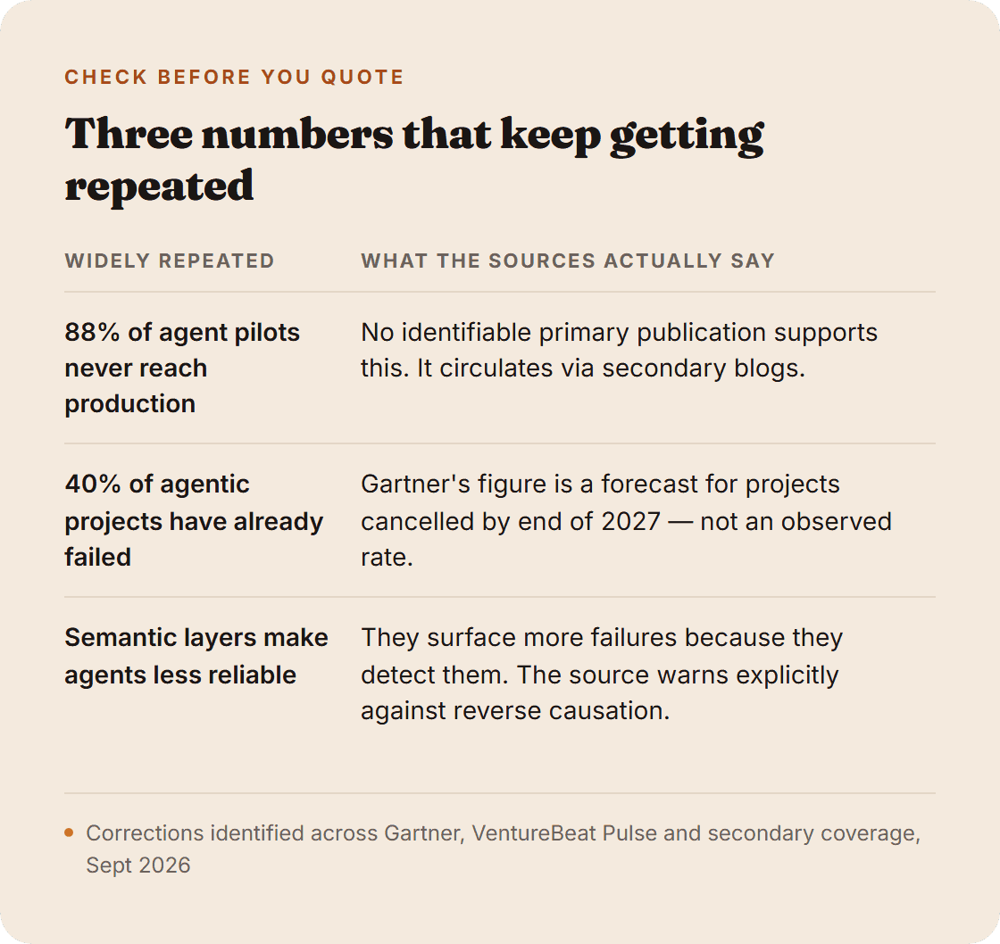
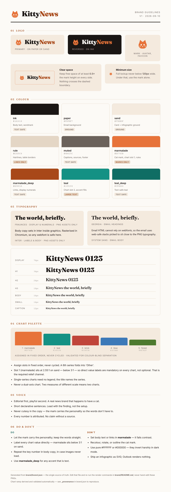

# KittyNews — an agent-built newsletter pipeline


Say a topic, get back a researched, fact-checked, branded HTML newsletter with custom
infographics — sitting in Gmail as a draft, ready to review and send. Built as a working
demo of an **agent-orchestrated pipeline**: an LLM handles research and editorial judgment,
deterministic Python scripts handle everything that has to be correct every time.

This isn't a product — it's a demo repo, built and documented as I went, including the
parts that broke.

## What's actually interesting here

**The plumbing is what breaks, not the model.** Three real findings from building this:

- **A brand color that looked fine and failed WCAG.** The KittyNews orange measures
  2.91:1 as text — under even the 3:1 large-text bar. Caught by running the palette
  through a contrast validator instead of eyeballing it. A deeper shade now carries every
  text role; the bright one is reserved for marks only. See `brand/brand.json` →
  `_provenance`.
- **The obvious email integration silently breaks the design.** Sending through a
  generic Gmail connector looked like the fast path — until decoding the raw MIME it
  produced showed every `` tag and background color stripped out. Verified
  empirically before building five tools on top of it, then switched to SMTP with an
  app password for full control of the envelope.
- **A live API's request shape doesn't match memorized assumptions.** A hand-rolled
  first pass at Perplexity's Agent API guessed at three things — the endpoint, where
  search filters nest, a step-count floor — and got all three wrong. Rewritten against
  the published docs, request by request.

**A fact-checking gate that makes fabrication structurally hard.** Every number bound
for an infographic has to trace back to a URL in the research corpus, or the render
fails with the orphaned figure named. Not a style guideline — a script that blocks
the build.



## How it works

```
topic
  → Perplexity Agent API research (structured, cited findings)
  → fact-check gate (every figure verified against a source)
  → brand-consistent infographics (Jinja2 → headless Chromium → PNG)
  → MJML email assembly (+ plain-text alternative)
  → Gmail draft, inline images, ready for a human to send
```

Every piece renders from one source of truth, [`brand/brand.json`](brand/brand.json) —
the logo, the generated brand guidelines sheet, every infographic type, and the email
shell all read the same palette and type scale, so nothing can drift out of sync.



## Stack

Python · [Perplexity Agent API](https://docs.perplexity.ai/) (web-grounded research,
structured output) · Jinja2 · MJML (responsive email HTML) · Playwright (headless
Chromium rendering) · Pillow (PNG optimization) · Gmail via SMTP/IMAP

No frontend, no database, no hosting — every artifact is a file, every step is a CLI
tool that takes JSON in and prints JSON out.

## Structure

Built on the **WAT framework** (Workflows / Agents / Tools) — see [`CLAUDE.md`](CLAUDE.md)
for the operating model.

| Path | What's there |
| --- | --- |
| `workflows/` | The SOP an agent follows, in plain language — see [`build_newsletter.md`](workflows/build_newsletter.md), including a dated log of what broke and what fixed it |
| `tools/` | Deterministic scripts — research, fact-check, render, build, deliver |
| `brand/` | The single source of truth for the KittyNews identity |
| `templates/` | The email shell and four infographic types |
| `archive/` | Past issues, committed — [issue 001](archive/2026-09-10-agentic-ai/) shipped end to end against live APIs |

## Status

A working demo, not a running publication. One issue has been researched, fact-checked,
rendered, and delivered through a live Gmail account. Read `workflows/build_newsletter.md`
for the full build log, including what didn't work on the first try.
